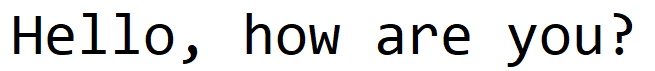

# Picture Text Translator

Picture Text Translator is a Python software created by using Tesseract, Googletrans and PIL libraries, and converts the text in the image to the desired language.

## Installation

To run this project first you have to install;

 - Tesseract
 - Googletrans library
 - Python Image Library (PIL)
 
If everything is ready, you need to paste the address of the location where tesseract.exe is installed in the comment line field in the `translator.py` file. Thats it!

## Usage

This is my picture that i want to translate;

  
  
  and picture and `translator.py` are in the same folder.
  
  

    textInPicture = pytesseract.image_to_string(Image.open('English.png'), lang='eng',config='-c page_separator='' ')
    
    translator = Translator()
    
    translation = translator.translate(textInPicture.lower() , dest="tr")
    
    print(f"{textInPicture}--> {translation.text}")

and when we are run the `translator.py`, we will see this output.

  
